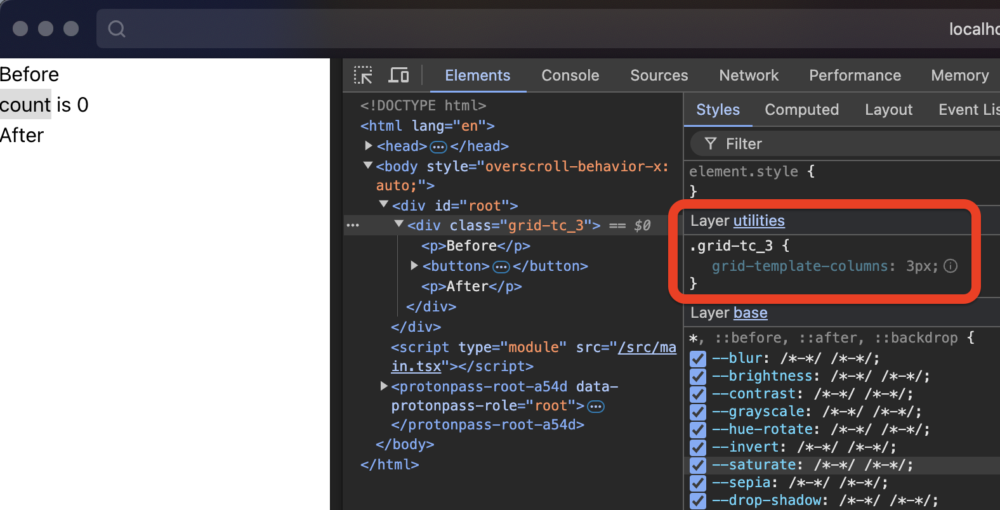

# Bug reproduction

## Steps

- Follow installation guide: https://panda-css.com/docs/installation/vite
- Add a grid using this documentation: https://panda-css.com/docs/utilities/flex-and-grid#grid

## Issue

The generated css should be `repeat(<value>, minmax(0, 1fr))`

